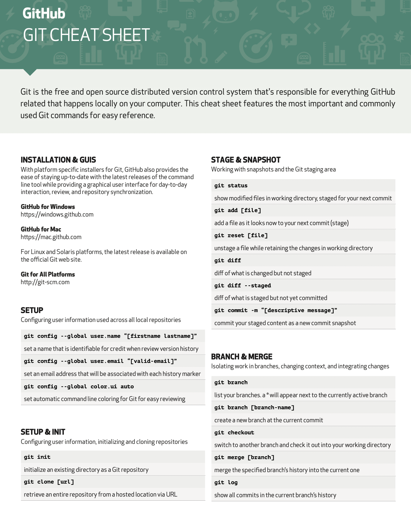
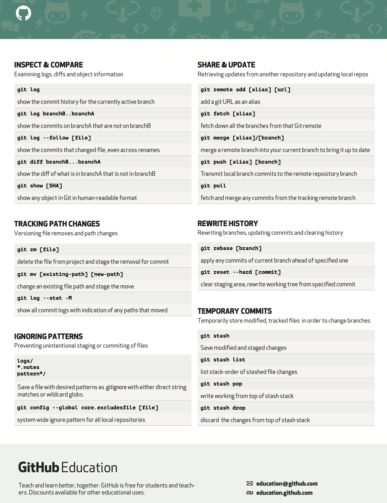

<h1 align = "center"> Git Cheatsheet <h1>
 
 <h4> This folder includes information related to Git, which includes the git commands cheat sheet by GitHub education which is more than enough to get you started with using Git as a version control for maintaining and manipulating your project's history, by using these commands use can do a lot of things like cloning the repositories on your local machine and than work on them, create new branches work on them and then push them and you can even raise a PR and a lot more.</h4>
 
 
 
 

     
PAGE-1 🤩

 
  

   

     
PAGE-2 🤠

 
     

